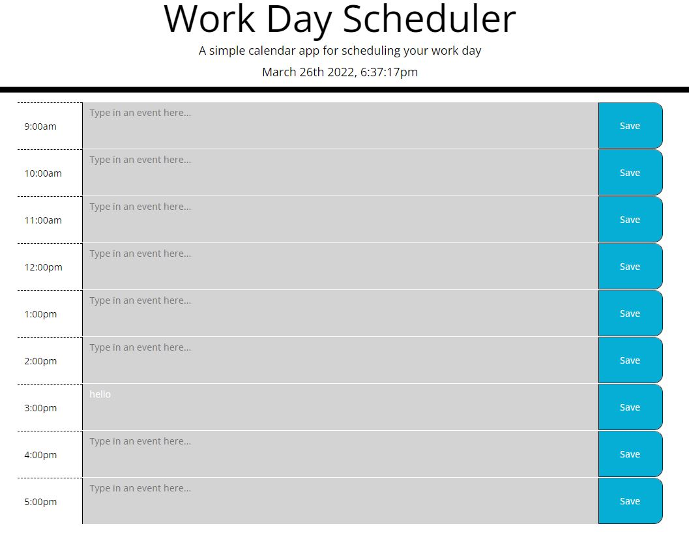

# Work-Day-Scheduler

## Description

- This is my first jQuery, moment.js and Bootstrap framework homework assignment for the Full Stack Web Development bootcamp.
- The homework assignment was to create a Work Day Scheduler that allows a user to save events for each hour of the work day. A starter HTML code was provided, but all of the JS was up to me. 
- Using moment.js the day scheduler hour blocks dynamically update their background color depending on the hour blocks relation to the current moment.js live time. For example, hour blocks display a gray background color if they have already past. A red background color is used for present hour, and a green background color to represent hour blocks in the future.
- In completing this assignment I was able to apply the lessons from week five: using jQuery to manipulate the DOM in my JS file, work with the Bootstrap framework to modify my HTML and use already established classes in CSS, work with moment.js, and save and retrieve data to and from the local storage. 

The following is a desktop screenshot of the final version of the webpage when it was first submitted for review (Notice: The screenshot was taken after the last hour block on the scheduler so all background colors are gray):

## Credits

For this homework assignment, I applied what was taught in the fifth week of class and used the following webpages as resources to bring the project together. The last link is a link shared by a classmate on how to create a live updating clock with javaScript and moment.js. 

- [Bootstrap](https://getbootstrap.com/docs/5.1/getting-started/introduction/)

- [Moment.js Guides](https://momentjs.com/guides/)

- [Live updating clock](https://levelup.gitconnected.com/how-to-use-moment-js-to-create-a-live-updating-clock-in-vanilla-javascript-20ae33ef2fd1)

## License

MIT License

Copyright (c) [2022] [Cristobal Marquez-Glynn]

Permission is hereby granted, free of charge, to any person obtaining a copy
of this software and associated documentation files (the "Software"), to deal
in the Software without restriction, including without limitation the rights
to use, copy, modify, merge, publish, distribute, sublicense, and/or sell
copies of the Software, and to permit persons to whom the Software is
furnished to do so, subject to the following conditions:

The above copyright notice and this permission notice shall be included in all
copies or substantial portions of the Software.

THE SOFTWARE IS PROVIDED "AS IS", WITHOUT WARRANTY OF ANY KIND, EXPRESS OR
IMPLIED, INCLUDING BUT NOT LIMITED TO THE WARRANTIES OF MERCHANTABILITY,
FITNESS FOR A PARTICULAR PURPOSE AND NONINFRINGEMENT. IN NO EVENT SHALL THE
AUTHORS OR COPYRIGHT HOLDERS BE LIABLE FOR ANY CLAIM, DAMAGES OR OTHER
LIABILITY, WHETHER IN AN ACTION OF CONTRACT, TORT OR OTHERWISE, ARISING FROM,
OUT OF OR IN CONNECTION WITH THE SOFTWARE OR THE USE OR OTHER DEALINGS IN THE
SOFTWARE.

## Badges

Coming Soon

## How to Contribute

Please feel free to review my code at [GITHUB](https://github.com/CM-GDev/Work-Day-Scheduler) for this project and make any suggestions on improvements.

Here is the live webpage [link](https://cm-gdev.github.io/Work-Day-Scheduler/) to the latest version. 